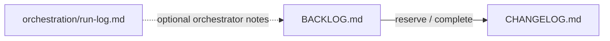

# Agent workflows — tcg-decks

## Roles

| Role                    | Document                                           | Responsibility                                                                                                                |
| ----------------------- | -------------------------------------------------- | ----------------------------------------------------------------------------------------------------------------------------- |
| **Coding agent**        | [agent-onboarding.md](./agent-onboarding.md)       | Implements changes in `src/`, `convex/`, and tests; runs verification; updates backlog/changelog when your process uses them. |
| **Orchestration agent** | [orchestration-agent.md](./orchestration-agent.md) | Selects work, hands off to exactly one coding agent at a time, tracks outcomes; does **not** edit application code.           |

Do **not** mix the two roles in one session if your goal is a clean delegate loop.

## Context boundaries

1. **Product truth:** [PRODUCT_VISION.md](./PRODUCT_VISION.md) and [SYSTEM_ANALYSIS.md](./SYSTEM_ANALYSIS.md).
2. **UI structure:** [component-architecture-playbook.md](./component-architecture-playbook.md) for every non-trivial feature.
3. **Hygiene:** [CODE_SIZE_POLICY.md](./CODE_SIZE_POLICY.md) when splitting or adding large files.

## Artifact flow

## Example tree elsewhere in the repo

The `**_reference/docs/**` directory shows a richer documentation tree (including archived specs and phase notes). Borrow **folder names and habits** from there when expanding this `docs/` tree; do not treat Pepe-Silvia-specific content as tcg-decks truth.

## See also

- [ARCHITECTURE_PLAN.md](./ARCHITECTURE_PLAN.md)
- Repository [AGENTS.md](../AGENTS.md) for editor skill hints

