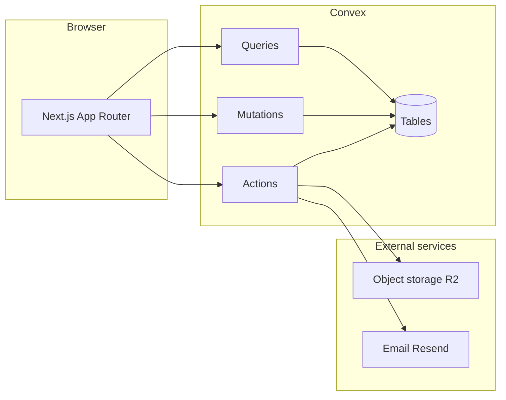

# System analysis — tcg-decks

This document is the **runtime and structural** view: what runs where, what data exists, and how major flows connect. Product intent lives in [PRODUCT_VISION.md](./PRODUCT_VISION.md).

## Context diagram (logical)

## Client application

- **Framework:** Next.js (App Router), React 19.
- **Routes:** Under `src/app/`; authenticated areas use `(app)` grouping (decks, gallery, collection, community, settings, admin).
- **UI:** Component library patterns aligned with Shadcn/Radix-style primitives; non-trivial features should follow [component-architecture-playbook.md](./component-architecture-playbook.md).

## Backend (Convex)

- **Data:** `convex/schema.ts` defines tables including users (beyond auth tables), sets, cards (with search indexes), decks, collections, tier lists and items, community ranking snapshots, sessions, subscriptions, and engagement tables (likes, views, comments) as implemented.
- **API surface:** TypeScript modules under `convex/` expose queries, mutations, and actions consumed via generated `api`.
- **Auth:** `@convex-dev/auth` extends the schema with auth tables; app-specific `users` table stores profile and role fields used by the product.

## Integrations

- **Storage:** `@convex-dev/r2` and AWS S3 client usage for card imagery and uploads (see codebase and Convex component config).
- **Email:** `resend` for transactional email when wired.

## Major data flows

1. **Gallery and search** — Client subscribes to Convex queries; card search uses Convex search indexes on derived fields such as `searchName`, `searchText`, `searchAll`.
2. **Deck build** — Deck documents store ordered card ids, quantities, layout metadata, and format fields; mutations persist edits; public decks are readable under index rules.
3. **Collection** — Per-user rows keyed by user and card with quantity and optional condition/foil.
4. **Tier lists and rankings** — Tier list documents hold tier definitions and metadata; items assign cards to lanes; scheduled or triggered jobs compute community rankings and snapshots (details in [community-tier-list-system.md](./community-tier-list-system.md)).

## Cross-cutting concerns

- **Authorization:** Mutations must enforce ownership or role checks consistent with Convex validators and auth identity.
- **Realtime:** Convex subscriptions drive live UI updates where used.
- **Performance:** Heavy aggregates lean on snapshot tables so read paths stay bounded.

## Code structure expectations

- **Frontend features:** Prefer feature folders with a stable public path re-exporting `content.tsx`, colocated `hook.ts` / `context.tsx` when needed ([component-architecture-playbook.md](./component-architecture-playbook.md)).
- **Convex:** Split large domains into modules by concern when files grow; keep API paths stable when refactoring internals.

## See also

- [ARCHITECTURE_PLAN.md](./ARCHITECTURE_PLAN.md)
- [TECH_STACK_DETAILS.md](./TECH_STACK_DETAILS.md)

