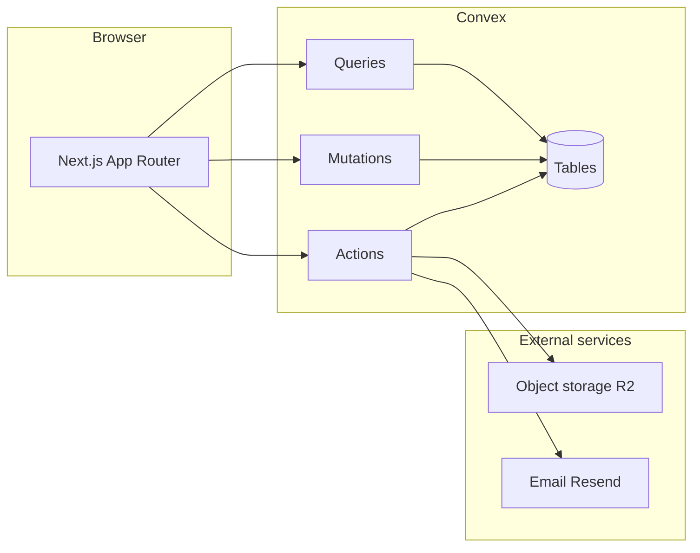

# System analysis — tcg-decks

This document is the **runtime and structural** view: what runs where, what data exists, and how major flows connect. Product intent lives in [PRODUCT_VISION.md](./PRODUCT_VISION.md).

## Context diagram (logical)

## Client application

- **Framework:** Next.js (App Router), React 19.
- **Routes:** Under `src/app/`; authenticated areas use `(app)` grouping (decks, gallery, collection, community, settings, admin).
- **UI:** Component library patterns aligned with Shadcn/Radix-style primitives; non-trivial features should follow [component-architecture-playbook.md](./component-architecture-playbook.md).
- **Theme:** `ColorSchemeProvider` applies palette tokens via **`data-color-theme`** (preset id or `custom`), light/dark via the `dark` class and `color-scheme`, and chrome via **`data-chrome`** (`calm`, `expressive`, `holoterminal`, `bubblegum`, `darkmatter`). Details: [theme-and-chrome.md](./theme-and-chrome.md).
- **Feature folders:** Several surfaces use the playbook layout (`content.tsx`, `hook.ts`, `types.ts`) — for example gallery view, deck details view, community rankings view, and collection entry re-exports.

## Backend (Convex)

- **Data:** `convex/schema.ts` defines tables including users (beyond auth tables), sets, cards (with search indexes), a singleton **`cardFacetSnapshot`** (rarities, types, set codes) rebuilt on admin release/import/clear, decks, collections, tier lists and items, community ranking snapshots, sessions, subscriptions, and engagement tables (likes, views, comments) as implemented. **Moderated binary uploads** use the `mediaAssets` table (`kind`: `team_logo` \| `profile_avatar`; `status` flows `pending` → `approved` \| `rejected` \| `needs_review`). Team logos: `api.mediaAssets.generateTeamLogoUploadUrl` / `submitTeamLogoUpload` → `internal.mediaAssetActions.runTeamLogoModeration` → `internal.mediaAssets.finalizeTeamLogoModeration`; `teams.logoAssetId` is set only when an asset is approved. Client-visible image URLs for that path come from `api.teams.logo.getTeamLogoPresentation`, which resolves `storage.getUrl` only for an **approved** asset on `logoAssetId` (not for pending or rejected rows). See [content-moderation-and-language-filter.md](./content-moderation-and-language-filter.md) §3.2.
- **API surface:** TypeScript modules under `convex/` expose queries, mutations, and actions consumed via generated `api`.
- **Auth:** `@convex-dev/auth` extends the schema with auth tables; app-specific `users` table stores profile and role fields used by the product.

## Integrations

- **Storage:** `@convex-dev/r2` and AWS S3 client usage for card imagery and uploads (see codebase and Convex component config).
- **Email:** `resend` for transactional email when wired.
- **YouTube (community media feed):** Curated video IDs live in Convex (`communityYoutubeCurations`); metadata is fetched server-side with the YouTube Data API v3 **`videos.list`** (parts `snippet`, `contentDetails`, `statistics`), batched up to 50 IDs per request, and cached in `youtubeVideoMetadataCache` with `fetchedAt` (six-hour freshness target; Convex cron refreshes every two hours). The **Convex deployment environment variable** `YOUTUBE_DATA_API_KEY` must be set in the Convex dashboard (never `NEXT_PUBLIC_*`); it is read only inside Convex actions in `convex/communityYoutube.ts`. Restrict the Google API key to **YouTube Data API v3** in Google Cloud and monitor quota there. The community UI uses `api.communityYoutube.getFeed` and does not call Google APIs directly.

## Major data flows

1. **Gallery and search** — Client subscribes to Convex queries; card search uses Convex search indexes on derived fields such as `searchName`, `searchText`, `searchAll`.
2. **Deck build** — Deck documents store ordered card ids, quantities, layout metadata, and format fields; mutations persist edits; public decks are readable under index rules. Format validation uses `setLegality` (`rotatesOutAt` vs `Date.now()` in `convex/formats.ts`) and `cardLegality` (bans/restrictions honor `effectiveDate` in `convex/deckValidation.ts`). Admin: `/admin/formats/[key]` tabs; note [legality-dates.md](./implementation/notes/legality-dates.md).
3. **Collection** — Per-user rows keyed by user and card with quantity and optional condition/foil.
4. **Tier lists and rankings** — Tier list documents hold tier definitions and metadata; items assign cards to lanes; scheduled or triggered jobs compute community rankings and snapshots (details in [community-tier-list-system.md](./community-tier-list-system.md)).

## Cross-cutting concerns

- **Authorization:** Mutations must enforce ownership or role checks consistent with Convex validators and auth identity.
- **Realtime:** Convex subscriptions drive live UI updates where used.
- **Performance:** Heavy aggregates lean on snapshot tables so read paths stay bounded. Client card **catalog** vs **formats/sets** use split React contexts in `CardDataProvider` so metadata consumers can avoid re-rendering on every catalog chunk; see [card-data-hooks.md](./card-data-hooks.md). The local card catalog **IndexedDB** blob (CAT-001) stores only gallery catalog rows; back faces load into memory after sync or cache read. If troubleshooting stale all-cards blobs, `clearCardCache()` in `src/lib/universus/card-store.ts` forces a full resync.

## Code structure expectations

- **Frontend features:** Prefer feature folders with a stable public path re-exporting `content.tsx`, colocated `hook.ts` / `context.tsx` when needed ([component-architecture-playbook.md](./component-architecture-playbook.md)).
- **Convex:** Split large domains into modules by concern when files grow; keep API paths stable when refactoring internals.

## See also

- [ARCHITECTURE_PLAN.md](./ARCHITECTURE_PLAN.md)
- [TECH_STACK_DETAILS.md](./TECH_STACK_DETAILS.md)
- [theme-and-chrome.md](./theme-and-chrome.md)
- [smoke-checklist.md](./smoke-checklist.md)

