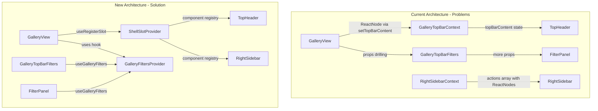

# Gallery Refactor and Best Practices Implementation

## Architecture Overview

This refactoring introduces two major architectural improvements:

1. **Shell Slot Registry** - A unified context for managing TopBar and RightSidebar content slots using component references instead of ReactNodes
2. **GalleryFiltersProvider** - Consolidates all filter state and actions, eliminating prop drilling




### Why Registry Pattern over ReactNode in State

The current implementation stores `ReactNode` in context state:

```tsx
const [topBarContent, setTopBarContent] = useState<ReactNode | null>(null);
```

**Problems:**

- ReactNodes are recreated every render, breaking memoization
- Context value changes on every `setTopBarContent` call
- All consumers re-render when content changes
- The `useMemo` wrapping the context value is ineffective

**Solution:** Store component references (functions) instead of instances:

```tsx
const [slots, setSlots] = useState<Map<string, ComponentType>>(new Map());
```

Component references are stable, enabling proper memoization.

---

## Phase 0: Create Shell Slot Registry

Create a unified provider that replaces `GalleryTopBarContext`, `AdminTopBarContext`, and `RightSidebarContext`.

### New File: `[src/components/shell/shell-slot-provider.tsx](src/components/shell/shell-slot-provider.tsx)`

```tsx
import { createContext, useContext, useState, useCallback, useMemo, useEffect, ComponentType, ReactNode } from "react";

type SlotArea = "top-bar" | "right-sidebar";

interface SlotRegistration {
  id: string;
  component: ComponentType;
  priority?: number;
}

interface ShellSlotState {
  slots: Map<SlotArea, SlotRegistration[]>;
  activeSidebarActionId: string | null;
}

interface ShellSlotActions {
  registerSlot: (area: SlotArea, registration: SlotRegistration) => void;
  unregisterSlot: (area: SlotArea, id: string) => void;
  setActiveSidebarAction: (id: string | null) => void;
}

interface ShellSlotContextValue {
  state: ShellSlotState;
  actions: ShellSlotActions;
}

const ShellSlotContext = createContext<ShellSlotContextValue | null>(null);

export function ShellSlotProvider({ children }: { children: ReactNode }) {
  const [slots, setSlots] = useState<Map<SlotArea, SlotRegistration[]>>(new Map());
  const [activeSidebarActionId, setActiveSidebarActionIdState] = useState<string | null>(null);

  const registerSlot = useCallback((area: SlotArea, registration: SlotRegistration) => {
    setSlots(prev => {
      const next = new Map(prev);
      const areaSlots = next.get(area) ?? [];
      const filtered = areaSlots.filter(s => s.id !== registration.id);
      next.set(area, [...filtered, registration].sort((a, b) => (a.priority ?? 0) - (b.priority ?? 0)));
      return next;
    });
  }, []);

  const unregisterSlot = useCallback((area: SlotArea, id: string) => {
    setSlots(prev => {
      const next = new Map(prev);
      const areaSlots = next.get(area) ?? [];
      next.set(area, areaSlots.filter(s => s.id !== id));
      return next;
    });
  }, []);

  const setActiveSidebarAction = useCallback((id: string | null) => {
    setActiveSidebarActionIdState(id);
  }, []);

  const value = useMemo((): ShellSlotContextValue => ({
    state: { slots, activeSidebarActionId },
    actions: { registerSlot, unregisterSlot, setActiveSidebarAction },
  }), [slots, activeSidebarActionId, registerSlot, unregisterSlot, setActiveSidebarAction]);

  return (
    <ShellSlotContext.Provider value={value}>
      {children}
    </ShellSlotContext.Provider>
  );
}

export function useShellSlot() {
  const context = useContext(ShellSlotContext);
  if (!context) {
    throw new Error("useShellSlot must be used within ShellSlotProvider");
  }
  return context;
}

export function useRegisterSlot(
  area: SlotArea,
  id: string,
  Component: ComponentType,
  priority?: number
) {
  const { actions } = useShellSlot();

  useEffect(() => {
    actions.registerSlot(area, { id, component: Component, priority });
    return () => actions.unregisterSlot(area, id);
  }, [area, id, Component, priority, actions]);
}

export function SlotRenderer({ area }: { area: SlotArea }) {
  const { state } = useShellSlot();
  const areaSlots = state.slots.get(area) ?? [];

  return (
    <>
      {areaSlots.map(({ id, component: Component }) => (
        <Component key={id} />
      ))}
    </>
  );
}
```

### Key Features:

- **Unified context** for all shell slots (top-bar, right-sidebar)
- **Component references** instead of ReactNodes - stable, memoizable
- **Priority ordering** for multiple slots in same area
- **Automatic cleanup** via useEffect return
- **Sidebar action state** built-in for right-sidebar expansion

### Usage Pattern:

```tsx
function GalleryView() {
  useRegisterSlot("top-bar", "gallery-filters", GalleryTopBarFilters);
  useRegisterSlot("right-sidebar", "active-deck", ActiveDeckPanel);
  return <div>...</div>;
}

function TopHeader() {
  return (
    <header>
      <SlotRenderer area="top-bar" />
    </header>
  );
}
```

---

## Phase 1: Create GalleryFiltersProvider

Create a new provider that consolidates all filter-related state and actions.

### New File: `[src/providers/GalleryFiltersProvider.tsx](src/providers/GalleryFiltersProvider.tsx)`

```tsx
interface GalleryFiltersState {
  search: string;
  searchMode: "name" | "text" | "all";
  filters: CardFilters;
  effectiveFormat: string;
}

interface GalleryFiltersActions {
  setSearch: (search: string) => void;
  setSearchMode: (mode: SearchMode) => void;
  updateFilter: <K extends keyof CardFilters>(key: K, value: CardFilters[K]) => void;
  clearAllFilters: () => void;
}

interface GalleryFiltersMeta {
  totalCards: number;
  filteredCount: number;
  filteredCards: CachedCard[];
  uniqueValues: UniqueValues | null;
  formats: Array<{ key: string; name: string }>;
  activeFilterCount: number;
}

interface GalleryFiltersContextValue {
  state: GalleryFiltersState;
  actions: GalleryFiltersActions;
  meta: GalleryFiltersMeta;
}
```

Key implementation details:

- Consumes `useUIState()` and `useCardData()` internally
- Manages local `search` and `searchMode` state
- Computes `filteredCards` and `activeFilterCount` as derived state
- Uses functional `setState` for stable callbacks (no dependency arrays needed)

### Update `[src/providers/index.ts](src/providers/index.ts)`

Export the new provider and hook.

---

## Phase 2: Refactor Gallery Components

### `[src/components/gallery/gallery-view.tsx](src/components/gallery/gallery-view.tsx)`

**Changes:**

- Remove local `search`, `searchMode` state (now in provider)
- Remove filter computation logic (now in provider)
- Use `useGalleryFilters()` hook to get `filteredCards`
- Simplify `useEffect` for top bar content

```tsx
export function GalleryView() {
  const { meta } = useGalleryFilters();
  
  useRegisterSlot("top-bar", "gallery-filters", GalleryTopBarFilters);
  useRegisterSlot("right-sidebar", "active-deck", ActiveDeckSidebar);

  return (
    <div className="flex flex-col h-full">
      <div className="flex-1 overflow-y-auto p-4">
        <InfiniteCardGrid cards={meta.filteredCards} />
      </div>
    </div>
  );
}
```

**Key improvements:**

- No more `useEffect` for setting top bar content
- Uses declarative `useRegisterSlot` hook
- Automatic cleanup when component unmounts
- No ReactNode passed through context

### `[src/components/gallery/gallery-header.tsx](src/components/gallery/gallery-header.tsx)`

**Changes:**

- Remove all props from `GalleryTopBarFilters` (now uses `useGalleryFilters()`)
- `FilterPanel` uses `useGalleryFilters()` directly
- `MultiSelectFilter`, `RangeFilter`, `SymbolSelectFilter` become simpler

```tsx
export function GalleryTopBarFilters() {
  const { state, actions, meta } = useGalleryFilters();
  
  return (
    <div className="flex items-center gap-2 w-full">
      <SearchInput 
        value={state.search}
        onChange={actions.setSearch}
        mode={state.searchMode}
        onModeChange={actions.setSearchMode}
      />
      <CardCount total={meta.totalCards} filtered={meta.filteredCount} />
      <FilterControls />
      <FilterSheet />
    </div>
  );
}
```

---

## Phase 3: Eliminate CardGridItem Prop Drilling

### `[src/components/universus/card-grid-item.tsx](src/components/universus/card-grid-item.tsx)`

**Changes:**

- Remove `hasActiveDeck`, `deckCount`, `onAddToDeck`, `onRemoveFromDeck` props
- Use `useActiveDeck()` hook directly inside the component

```tsx
interface CardGridItemProps {
  card: CachedCard;
  backCard?: CachedCard | null;
}

export function CardGridItem({ card, backCard }: CardGridItemProps) {
  const { hasActiveDeck, getCardCount, addCard, removeCard } = useActiveDeck();
  const deckCount = getCardCount(card._id);
  
  // ... rest of component
}
```

### `[src/components/gallery/gallery-view.tsx](src/components/gallery/gallery-view.tsx)` - InfiniteCardGrid

**Changes:**

- Remove `allCards` prop
- Simplify to only pass `card` and `backCard` to `CardGridItem`
- Move `cardIdMap` computation inside component or use card data provider

---

## Phase 4: Migrate Shell Components to Slot Registry

### `[src/components/shell/top-header.tsx](src/components/shell/top-header.tsx)`

**Changes:**

- Remove conditional rendering for gallery/admin
- Use `SlotRenderer` for dynamic content

```tsx
export function TopHeader() {
  return (
    <header className="relative flex h-14 shrink-0 items-center bg-sidebar px-4">
      <div className="flex items-center gap-2 z-10 shrink-0">
        <Link href="/home" className="flex items-center gap-2">
          <div className="flex h-8 w-8 shrink-0 items-center justify-center rounded-lg bg-primary">
            <Layers className="h-4 w-4 text-primary-foreground" />
          </div>
          <span className="whitespace-nowrap text-lg font-semibold text-sidebar-foreground">
            UVSDECKS.GG
          </span>
        </Link>
      </div>

      <div className="flex-1 flex items-center justify-center px-4 overflow-hidden">
        <SlotRenderer area="top-bar" />
      </div>
    </header>
  );
}
```

### `[src/components/shell/right-sidebar.tsx](src/components/shell/right-sidebar.tsx)`

**Changes:**

- Remove `actions` prop entirely
- Use `useShellSlot()` to get sidebar slots and active state
- Render slot components dynamically

```tsx
export function RightSidebar() {
  const { state, actions } = useShellSlot();
  const sidebarSlots = state.slots.get("right-sidebar") ?? [];
  const activeActionId = state.activeSidebarActionId;

  if (sidebarSlots.length === 0) return null;

  const activeSlot = sidebarSlots.find(s => s.id === activeActionId);
  const ActiveComponent = activeSlot?.component;

  return (
    <div className="flex h-full bg-sidebar">
      {activeActionId && ActiveComponent && (
        <motion.div className="...">
          <ActiveComponent />
        </motion.div>
      )}
      <div className="flex h-full w-12 flex-col items-center gap-1 bg-sidebar pt-1 pb-3">
        {sidebarSlots.map((slot) => (
          <SidebarActionButton
            key={slot.id}
            slot={slot}
            isActive={activeActionId === slot.id}
            onClick={() => actions.setActiveSidebarAction(
              activeActionId === slot.id ? null : slot.id
            )}
          />
        ))}
      </div>
    </div>
  );
}
```

### `[src/components/shell/mobile-actions-sheet.tsx](src/components/shell/mobile-actions-sheet.tsx)`

**Changes:**

- Remove `actions` prop
- Use `useShellSlot()` to get sidebar slots

### `[src/components/shell/mobile-actions-trigger.tsx](src/components/shell/mobile-actions-trigger.tsx)`

**Changes:**

- Remove `hasActions` prop
- Derive from `useShellSlot().state.slots.get("right-sidebar")?.length > 0`

### `[src/app/(app)/layout.tsx](src/app/(app)`/layout.tsx)

**Changes:**

- Remove `GalleryTopBarProvider` and `AdminTopBarProvider` wrappers
- Add `ShellSlotProvider` at the top level
- Remove action prop passing to all shell components
- Remove `getLayoutSidebarActions` function
- Simplify `ShellLayoutInner` significantly

```tsx
export default function AppLayout({ children }: { children: ReactNode }) {
  return (
    <AuthGuard>
      <UIStateProvider>
        <ActiveDeckProvider>
          <TcgDndProvider>
            <ShellSlotProvider>
              <ShellLayout>{children}</ShellLayout>
            </ShellSlotProvider>
          </TcgDndProvider>
        </ActiveDeckProvider>
      </UIStateProvider>
    </AuthGuard>
  );
}

function ShellLayoutInner({ children }: { children: ReactNode }) {
  const pathname = usePathname();
  const [leftSidebarCollapsed, setLeftSidebarCollapsed] = useState(false);
  const { state } = useShellSlot();
  
  const hasRightSidebar = (state.slots.get("right-sidebar")?.length ?? 0) > 0;

  return (
    <div className="hidden md:flex h-screen w-full flex-col overflow-hidden">
      <TopHeader />
      <div className="flex flex-1 overflow-hidden bg-sidebar">
        <LeftSidebar collapsed={leftSidebarCollapsed} onToggle={toggleLeftSidebar} />
        <div className="flex flex-1 overflow-hidden">
          <main className="flex-1 overflow-hidden rounded-tl-xl bg-background">
            {children}
          </main>
          {hasRightSidebar && <RightSidebar />}
        </div>
      </div>
    </div>
  );
}
```

### Sidebar Action Registration Pattern

Instead of defining actions in layout, pages register their own sidebar content:

```tsx
function GalleryView() {
  useRegisterSlot("top-bar", "gallery-filters", GalleryTopBarFilters);
  useRegisterSlot("right-sidebar", "active-deck", ActiveDeckSidebar, { priority: 1 });

  return <div>...</div>;
}

function ActiveDeckSidebar() {
  const { activeDeck } = useActiveDeck();
  return (
    <div className="h-full overflow-y-auto p-4">
      {activeDeck ? <DeckEditor deck={activeDeck} /> : <NoDeckSelected />}
    </div>
  );
}
```

---

## Phase 5: Accessibility Fixes

### `[src/components/gallery/gallery-header.tsx](src/components/gallery/gallery-header.tsx)`


| Line    | Fix                                                          |
| ------- | ------------------------------------------------------------ |
| 84      | Add `aria-label="Clear filter"` to X button                  |
| 92-106  | Change `div` to `button` with `role="option"` or use `label` |
| 605-639 | Add `aria-label` to search mode toggle buttons               |
| 591     | Add `name="gallery-search"` and `spellCheck={false}`         |


### `[src/components/universus/card-grid-item.tsx](src/components/universus/card-grid-item.tsx)`


| Line  | Fix                                                              |
| ----- | ---------------------------------------------------------------- |
| 89-98 | Add `onFocus`/`onBlur` handlers, `tabIndex={0}`, `role="button"` |
| 84-87 | Add keyboard handler for flip (`onKeyDown` for Enter/Space)      |


### `[src/components/shell/left-sidebar.tsx](src/components/shell/left-sidebar.tsx)`


| Line    | Fix                                                                |
| ------- | ------------------------------------------------------------------ |
| 117-138 | Ensure Link wraps entire clickable area, remove motion.div onClick |


---

## Phase 6: Animation Best Practices

### Create `[src/lib/reduced-motion.ts](src/lib/reduced-motion.ts)`

```tsx
export function usePrefersReducedMotion(): boolean {
  const [prefersReducedMotion, setPrefersReducedMotion] = useState(false);
  
  useEffect(() => {
    const mediaQuery = window.matchMedia('(prefers-reduced-motion: reduce)');
    setPrefersReducedMotion(mediaQuery.matches);
    const handler = (e: MediaQueryListEvent) => setPrefersReducedMotion(e.matches);
    mediaQuery.addEventListener('change', handler);
    return () => mediaQuery.removeEventListener('change', handler);
  }, []);
  
  return prefersReducedMotion;
}
```

### Files to update:

- `[src/components/universus/card-grid-item.tsx](src/components/universus/card-grid-item.tsx)`: Disable flip animation when reduced motion preferred
- `[src/components/shell/left-sidebar.tsx](src/components/shell/left-sidebar.tsx)`: Reduce/disable sidebar animation

### Replace `transition-all` with explicit properties:

- `[src/components/gallery/gallery-view.tsx](src/components/gallery/gallery-view.tsx)` line 24: `transition-[width]`
- `[src/components/universus/card-grid-item.tsx](src/components/universus/card-grid-item.tsx)` line 92: `transition-[transform]`

---

## Phase 7: Typography Fixes

### Global search and replace:

- `"..."` -> `"…"` (ellipsis character)

Files:

- `[src/components/gallery/gallery-view.tsx](src/components/gallery/gallery-view.tsx)` line 196
- `[src/components/gallery/gallery-header.tsx](src/components/gallery/gallery-header.tsx)` lines 593-598

---

## Phase 8: Re-render Optimization

### `[src/providers/UIStateProvider.tsx](src/providers/UIStateProvider.tsx)`

**Changes:**

- Use functional `setState` in callbacks to remove dependencies:

```tsx
const setGalleryFilters = useCallback((filters: CardFilters) => {
  setUIState(prev => ({ ...prev, galleryFilters: filters }));
}, []);
```

- Use lazy state initialization:

```tsx
const [uiState, setUIState] = useState<UIState>(() => 
  typeof window === "undefined" ? {} : loadPersistedUIState()
);
```

### `[src/components/universus/card-grid-item.tsx](src/components/universus/card-grid-item.tsx)`

**Changes:**

- Wrap `handleFlip` in `useCallback`:

```tsx
const handleFlip = useCallback((e: React.MouseEvent) => {
  e.stopPropagation();
  setIsFlipped(prev => !prev);
}, []);
```

---

## Phase 9: Provider Composition

### `[src/app/(app)/layout.tsx](src/app/(app)`/layout.tsx)

The new provider hierarchy is simpler - no page-specific wrappers needed:

```tsx
export default function AppLayout({ children }: { children: ReactNode }) {
  return (
    <AuthGuard>
      <UIStateProvider>
        <ActiveDeckProvider>
          <TcgDndProvider>
            <ShellSlotProvider>
              <ShellLayout>{children}</ShellLayout>
            </ShellSlotProvider>
          </TcgDndProvider>
        </ActiveDeckProvider>
      </UIStateProvider>
    </AuthGuard>
  );
}
```

### `[src/app/(app)/gallery/page.tsx](src/app/(app)`/gallery/page.tsx)

Gallery page wraps content with `GalleryFiltersProvider`:

```tsx
import { GalleryFiltersProvider } from "@/providers";
import { GalleryView } from "@/components/gallery";

export default function GalleryPage() {
  return (
    <GalleryFiltersProvider>
      <GalleryView />
    </GalleryFiltersProvider>
  );
}
```

This pattern keeps the filter provider scoped to gallery pages only, rather than wrapping the entire app.

---

## Phase 10: Cleanup Deprecated Files

### Files to Delete:

- `[src/components/gallery/gallery-top-bar-context.tsx](src/components/gallery/gallery-top-bar-context.tsx)`
- `[src/components/admin/admin-top-bar-context.tsx](src/components/admin/admin-top-bar-context.tsx)`
- `[src/components/shell/right-sidebar-context.tsx](src/components/shell/right-sidebar-context.tsx)`

### Imports to Update:

Search for and remove all imports of:

- `GalleryTopBarProvider`, `useGalleryTopBar`, `GalleryTopBarContent`
- `AdminTopBarProvider`, `useAdminTopBar`, `AdminTopBarContent`
- `RightSidebarProvider`, `useRightSidebar`, `useRegisterSidebarActions`

Replace with:

- `ShellSlotProvider`, `useShellSlot`, `useRegisterSlot`, `SlotRenderer`

---

## Files Changed Summary

### New Files


| File                                           | Purpose                                       |
| ---------------------------------------------- | --------------------------------------------- |
| `src/components/shell/shell-slot-provider.tsx` | Unified slot registry for TopBar/RightSidebar |
| `src/providers/GalleryFiltersProvider.tsx`     | Filter state/actions/meta provider            |
| `src/lib/reduced-motion.ts`                    | usePrefersReducedMotion hook                  |


### Modified Files


| File                                              | Type of Change                                 |
| ------------------------------------------------- | ---------------------------------------------- |
| `src/providers/index.ts`                          | Export new providers                           |
| `src/components/shell/index.ts`                   | Export ShellSlotProvider                       |
| `src/components/shell/top-header.tsx`             | Use SlotRenderer, remove conditional rendering |
| `src/components/shell/right-sidebar.tsx`          | Use ShellSlotProvider, remove props            |
| `src/components/shell/mobile-actions-sheet.tsx`   | Use ShellSlotProvider, remove props            |
| `src/components/shell/mobile-actions-trigger.tsx` | Use ShellSlotProvider, remove props            |
| `src/components/shell/left-sidebar.tsx`           | A11y + reduced-motion                          |
| `src/components/gallery/gallery-view.tsx`         | Use useRegisterSlot + useGalleryFilters        |
| `src/components/gallery/gallery-header.tsx`       | Use useGalleryFilters, a11y fixes              |
| `src/components/universus/card-grid-item.tsx`     | Use useActiveDeck directly, a11y + perf        |
| `src/app/(app)/layout.tsx`                        | Simplify, add ShellSlotProvider                |
| `src/app/(app)/gallery/page.tsx`                  | Add GalleryFiltersProvider wrapper             |
| `src/providers/UIStateProvider.tsx`               | Functional setState + lazy init                |


### Deleted Files


| File                                                 | Reason                        |
| ---------------------------------------------------- | ----------------------------- |
| `src/components/gallery/gallery-top-bar-context.tsx` | Replaced by ShellSlotProvider |
| `src/components/admin/admin-top-bar-context.tsx`     | Replaced by ShellSlotProvider |
| `src/components/shell/right-sidebar-context.tsx`     | Replaced by ShellSlotProvider |


---

## Implementation Order

1. **Phase 0**: Create ShellSlotProvider (no breaking changes)
2. **Phase 1**: Create GalleryFiltersProvider (no breaking changes)
3. **Phase 2-3**: Refactor gallery components to use new providers
4. **Phase 4**: Migrate shell components to SlotRenderer
5. **Phase 5-8**: Accessibility, animation, typography, optimization fixes
6. **Phase 9**: Update provider composition in layout/pages
7. **Phase 10**: Delete deprecated context files

This order ensures we can build and test incrementally without breaking the app.